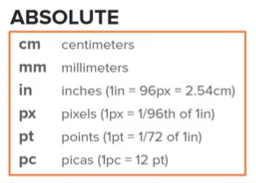
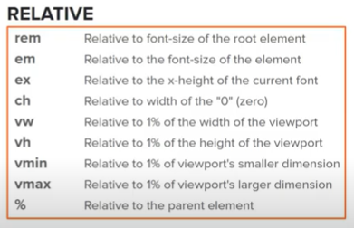
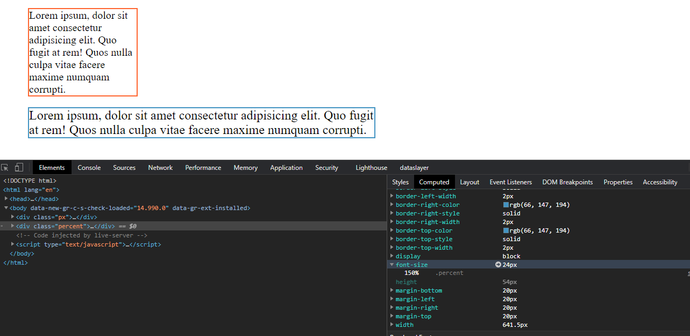

# Units of measurement

Notes from codeSTACKr's units of measurement tutorial. You can watch the tutorial [here](https://www.youtube.com/watch?v=8UTMS3WTM0k).

## Introduction

There are 15 units of measurement in CSS compatible with most browsers. This can be categorized into two groups: absolute, and relative UMs.

## px

`px` is short for pixels (the unit of measurements of screens). Sizes determined in pixels will always stay the same.

## percent

Percentage sizes refer to either a percentage of its parent element, or a percentage of a default size. For example, a `
` of `width: 50%;` will occupy 50% of its containing element. A font of `font-size: 150%` will be 1.5 times the size of the default font for that element. If no other declarations have been made, the default size for browsers is 16px. Therefore, a font of 150% size would be the same as a 24px `font-size`. We can check this in the computed tab of the browser:

