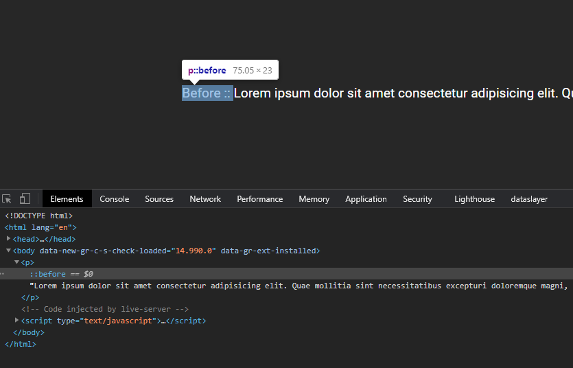

# Before and After pseudo elements

Notes from codeSTACKr's before and after pseudo elements tutorial. You can watch the tutorial [here](https://www.youtube.com/watch?v=-bwR9S5MmOI).

## How to use pseudo elements

To add a pseudo element first we need to target it with the `::` selector, like so:

``` css
p::before {
  content: "before content";
}
```

Keep in mind that before the realase of CSS3, both pseudo classes and pseudo elements where targeted with a single colon, `:`. You can still do it since it was left do to backwards compatibility, but it might be taken away in the future.

The first property that we want to add to every pseudo element is the `content`. Pseudo elements with no content will not be shown. This takes a string which gets added to the content of the targeted element. We can see this string in the browsers dev tools:



So we are creating elements, within an element, but this content cannot be selected on the page.

Just as anyother element, pseudo elements can be formatted with other CSS properties like `width`, `height`, or `background`.

One thing to keep in mind is that resets do not apply to pseudo elements by default. We can add them, like so:

``` css
*, *::before, *::after {
  box-sizing: border-box;
  margin: 0;
  padding: 0;
}
```

## When not to use pseudo elements

Never use a pseudo element for important copy or text since they are not selectable. Also keep in mind that pseudo elements might not be available in some screen readers.
