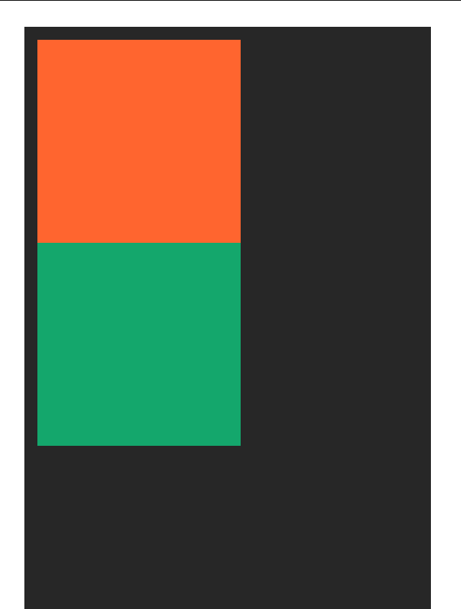
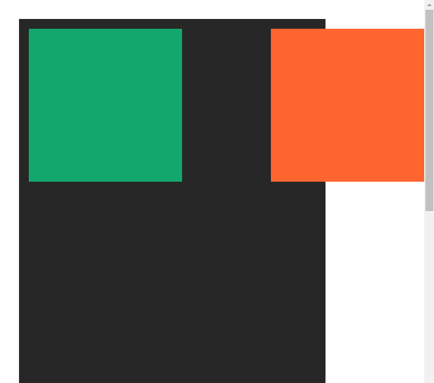
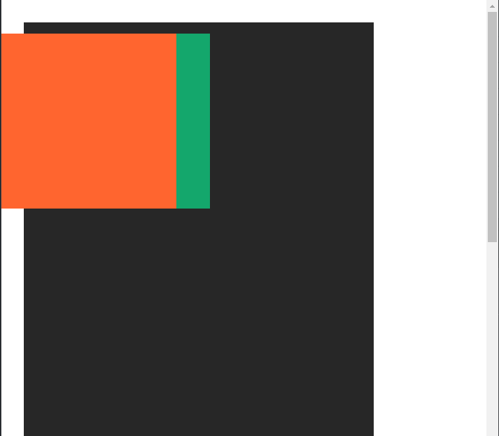
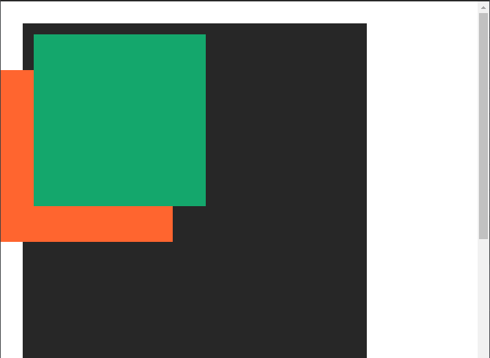

# Positioning

Notes from codeSTACKr's CSS position tutorial. You can watch the tutorial [here](https://www.youtube.com/watch?v=XrHMv_9LCfo).

## Static

Static positioning is the default positioning in CSS. Therefore, if we do not declare a position, it is static.

This position flows along with the HTML document flow. In this example we created two `div`s, which are block elements by default, so the first element we created (`class=child-box-1`) will be positioned at the top, and the second one (`class=child-box-2`) will be positioned after it.



## Relative

Relative position is similar to static, but we can now change the `top`, `right`, `bottom`, and `left` attributes. For example, if we set the first box to have `top=100px`, it will move down 100px from its original position.


If we now add `right=50px` it will move 50 pixes away from its right side original position.


Now box 1 is overflowing both its sibling (box 2) and its parent (box).

## Absolute

Absolute positioning removes the element from the document's flow and positions itself in reference to a container. That container must have a position too, otherwise, the child box will position itself in reference to the `html` element.


The reason why the green box does not show on our page is that to it, the orange box does not exist. Therefore, from green's perspective, he is the first child of the container (it is there, but it's behind the orange box).

If we now set `child-box-1` to have `right: 0;`, it will move all the way to the right since its reference position is the `html` element. We can now see `child-box-2`.



Similarly, if we set its `left: 0;`, then it goes all the way to the left.



Now we add `top: 100px;`, and `child-box-1` will remove itself 100 pixels from the top of the page.


If we wanted the green box to be on top of the orange box, we'd need to use the `z-index` property. But, keep in mind that `z-index` only works if the element has a position. Since we don't want it to be removed from the documents flow, we'll give it `position: relative;`

``` css
.child-box-2 {
  width: 250px;
  height: 250px;
  background: #14a76c;
  position: relative;
  z-index: 1;
}
```



Now, to make the orange box move inside its parent, we need to assign a position to the parent. To achieve this, we give the parent `position: relative;`. Now orange is still all the way to the left, but using its parent container as a reference.

``` css
.child-box-1 {
  position: absolute;
  left: 0;
  top: 100px;
  width: 250px;
  height: 250px;
  background: #ff652f;
}
```


If we change back orange so that now its right position it set to be 0 pixels, then it'll move all the way to the right-hand side of its parent.

``` css
.child-box-1 {
  position: absolute;
  right: 0;
  top: 100px;
  width: 250px;
  height: 250px;
  background: #ff652f;
}
```


## Fixed

When elements are set to `fixed` position they'll position themself relative to the screen. This will cause them to overflow their parents, but also to stay inside the viewport as you scroll down the page.

``` css
.child-box-1 {
  position: fixed;
  right: 0;
  top: 100px;
  width: 250px;
  height: 250px;
  background: #ff652f;
}
```


## Sticky

Sticky is a combination of relative and fixed. When used on its own, nothing happens. `child-box-2` is acting as if it's `relative` positioned.

``` css
.child-box-1 {
  width: 250px;
  height: 250px;
  background: #ff652f;
}

.child-box-2 {
  position: sticky;
  width: 250px;
  height: 250px;
  background: #14a76c;
}
```

But if we change `top: 0;` now the green box will start scrolling down with the screen and staying inside the viewport, until it reaches the end of its parent container. Likewise, when scrolling up, it will stick to the top of the screen, until it reaches its sibling.

``` css
.child-box-2 {
  position: sticky;
  top: 0;
  width: 250px;
  height: 250px;
  background: #14a76c;
}
```
