# CSS Flexbox

Notes from codeSTACKr's CSS Flexbox tutorial. You can watch the tutorial [here](https://www.youtube.com/watch?v=qqDH0T6K5gY).

### Table of content

[What is Flexbox?](#what-is-flexbox)  
[Aligning items](#aligning-items)  
[Flex direction](#flex-direction)  
[Flex flow](#flex-flow)  
[Flex grow & shrink](#flex-grow-&-shrink)  
[Flex basis](#flex-basis)  
[Flex](#flex)  
[Align self](#align-self)  
[Centering](#centering)  
[Ordering](#ordering)  

## What is Flexbox?

Flexbox is a layout mode in CSS3. It provides a more efficient way to lay out, align, and distribute space among items in a container. It's called Flexbox because it can handle unknown or dynamic sizes too. Before Flexbox, there were 4 layout modes:

- **Block layout** for laying out documents.  
- **Inline layout** for laying out text.  
- **Positioned layout** for explicit positioning.  
- **Table layout** for laying out 2D tabular data.  

## Aligning items

In our example we have three `div`s of different `min-height`. At the start, since `div`s are block-level elements, they all start in their own lines, so they are stack on top of each other.


With Flexbox we can set the display property to `display: flex;` and now our `div`s will not take up an entire row each. This happens because setting `display: flex;`, we are telling the browser that this is not a regular container, but a *flexbox container*, and the default for a flexbox container is to display elements in a row.

``` css
.flexbox-container {
  display: flex;
}
```


The Flexbox layout is *directionally agnostic*, as opposed to the block layout which is vertically based, or the inline layout which is horizontally based.

In Flexbox we have two axes. The main axis always follows the direction of the flexbox. By default, flexbox is layout as row and, therefore, the main axis is horizontal.


Also by default, all child elements will be aligned to the left of their parent container. There is a property called `justify-content` which allows us to change how the content of a flexbox is justified. By default, `justify-content: flex-start;` (this means left), but we can change it to, for example, `justify-content: flex-end;` and the elements will align right. There are several options to choose from, but keep in mind that they all distribute elements in reference to the main axis.

``` css
.flexbox-container {
  display: flex;
  background: #0a4b23;
  border: 3px solid #272727;
  justify-content: flex-end;
}
```


To modify how items are aligned about the cross-axis, we use the `align-items` property. By default this property is set to `stretch`. This is why, even though we set `min-height` property in all of them, they all stretch out as much as their parent container allows them to do. If we change to `align-items: flex-start;` the child elements will start from the top and stop stretching when they reach their respective `min-height`.

``` css
.flexbox-container {
  display: flex;
  background: #0a4b23;
  border: 3px solid #272727;
  justify-content: space-evenly;
  align-items: flex-start;
}
```


Now let's change the `width` property to 50%.

``` css
.flexbox-item {
  width: 50%;
  background-color: #ff652f;
  border: 3px solid #272727;
  color: #fff;
  font-size: 2em;
  padding: 20px;
  margin: 10px;
}
```

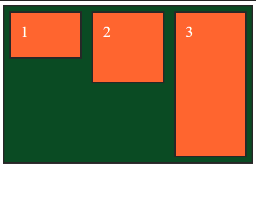

Oddly enough, our child boxes did expand a little bit, but they are definitely not taking up 50% of their parent's width. The reason why this happens is the `flex-wrap` property. This property determines whether flex items are forced onto on line (the default, `flex-wrap: nowrap;`), or can wrap onto multiple lines. If wrapping is allowed, the property sets the direction in which boxes are stacked.

``` css
.flexbox-container {
  display: flex;
  background: #0a4b23;
  border: 3px solid #272727;
  justify-content: space-evenly;
  align-items: flex-start;
  flex-wrap: wrap;
}
```

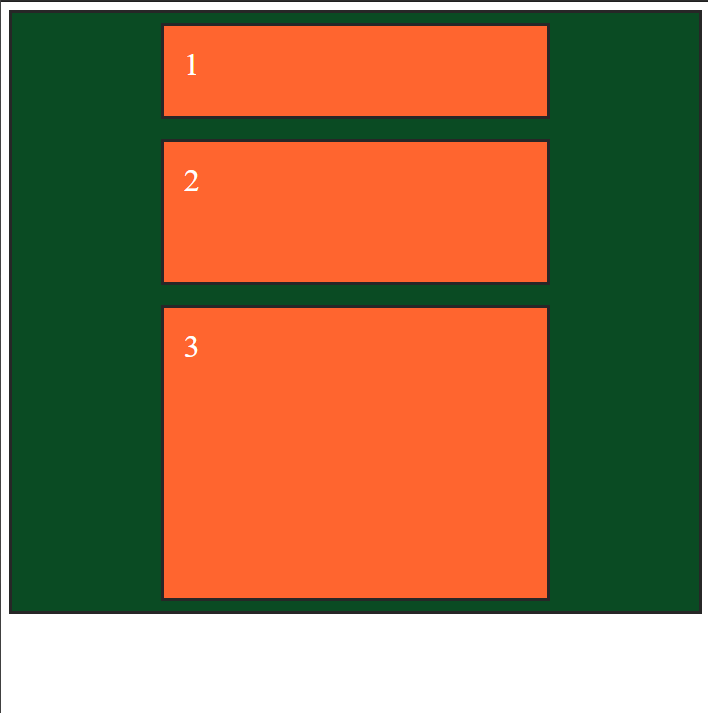

Now each child is indeed taking up 50% of their parent's width and wrapped onto a new line. In this example, two boxes cannot fit in one line because of the margins and paddings and borders that we've set. If we take the `width` down to, say 35%, now two can fit in one line.

``` css
.flexbox-item {
  width: 35%;
  background-color: #ff652f;
  border: 3px solid #272727;
  color: #fff;
  font-size: 2em;
  padding: 20px;
  margin: 10px;
}
```

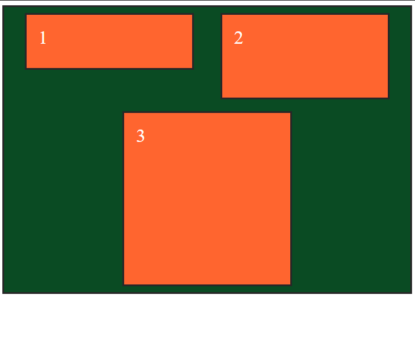

Another property for aligning stuff is `align-content`. The difference between the two is that `align-items` aligns the items in reference to each other, while `align-content` aligns all child elements in reference to their parent element. Both `align-content` and `justify-content` can take the same values.

``` css
.flexbox-container {
  height: 95vh;
  display: flex;
  background: #0a4b23;
  border: 3px solid #272727;
  justify-content: space-evenly;
  align-items: center;
  flex-wrap: wrap;
  align-content: center;
}
```

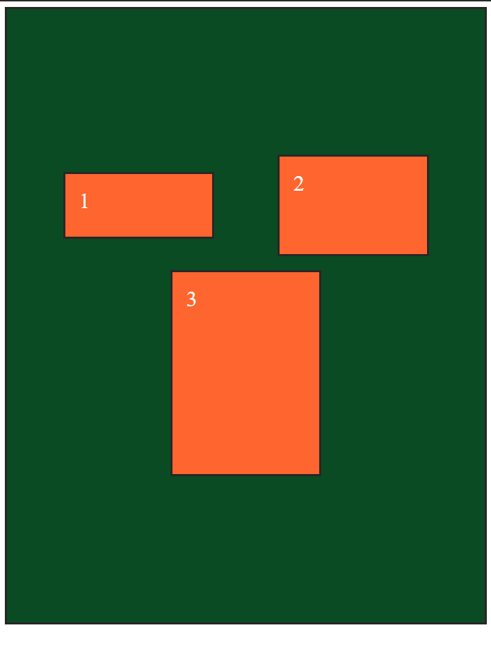

## Flex direction

To swap the axes we use the `flex-direction` property. This is set by default to `row`, but we can set it to `column` instead.

``` css
.flexbox-container {
  height: 95vh;
  background: #0a4b23;
  border: 3px solid #272727;
  display: flex;
  flex-direction: column;
}
```

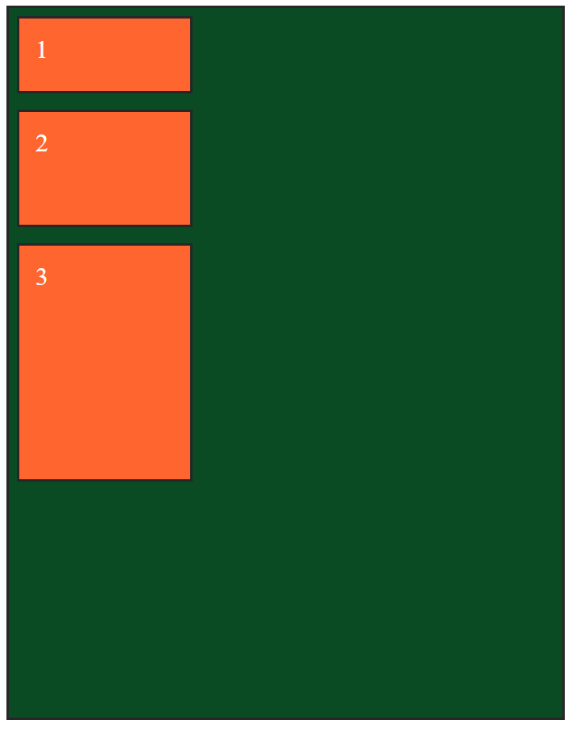

All the properties we covered above work just the same, but keep in mind that the main and cross axes are not in reverse position. So the main axis runs top to bottom of the parent `div`, while the cross axis now runs left to right of the parent `div`.

``` css
.flexbox-container {
  height: 95vh;
  background: #0a4b23;
  border: 3px solid #272727;
  display: flex;
  flex-direction: column;
  justify-content: space-between;
  align-items: center;
}
```

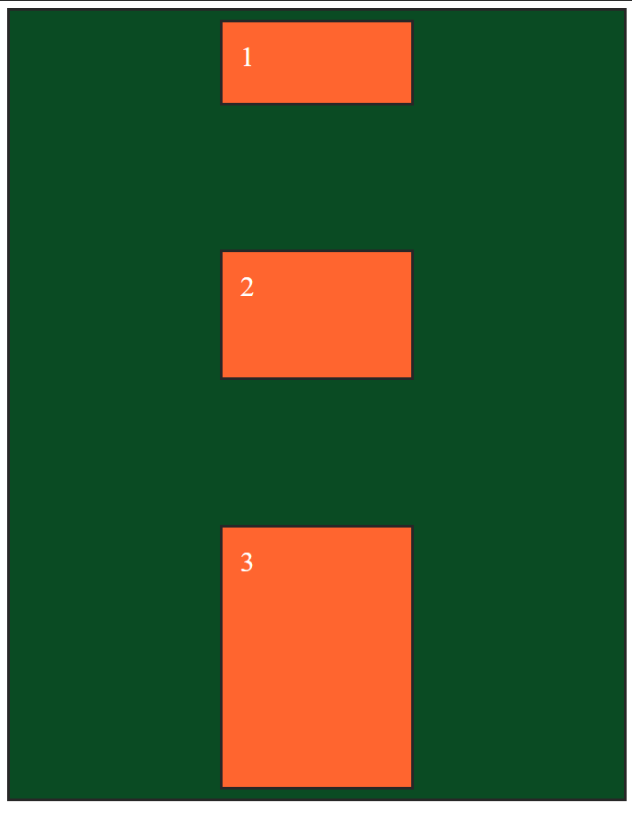

## Flex flow

`flex-flow` is a combination for `flex-direction` and `flex-wrap`. So for example, we could simplify by combining `flex-direction: columns;` and `flex-wrap: wap;` into `flex-flow: column wrap;`.

``` css
.flexbox-container {
  height: 95vh;
  background: #0a4b23;
  border: 3px solid #272727;
  display: flex;
  flex-flow: column wrap;
  justify-content: space-between;
  align-items: center;
}
```

## Flex grow & shrink

If we add `flex-grow: 1;` to one of the children elements, it will grow to fill out all of the available space (regardless of its width property).

``` css
.item-1 {
  min-height: 50px;
  flex-grow: 1;
}
```

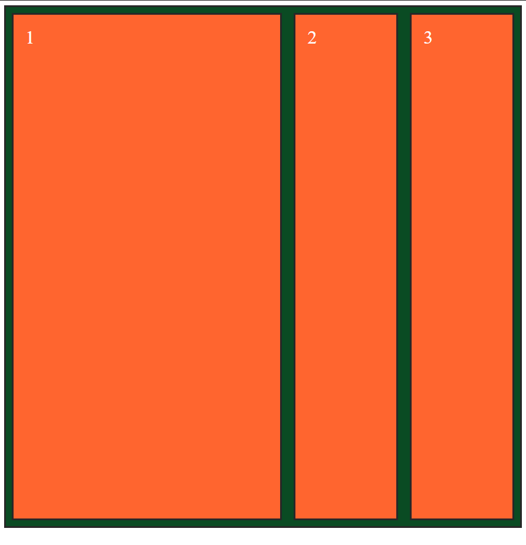

If we also set it to another child, then they will evenly distribute the extra space between themselves.

``` css
.item-3 {
  min-height: 250px;
  flex-grow: 1;
}
```

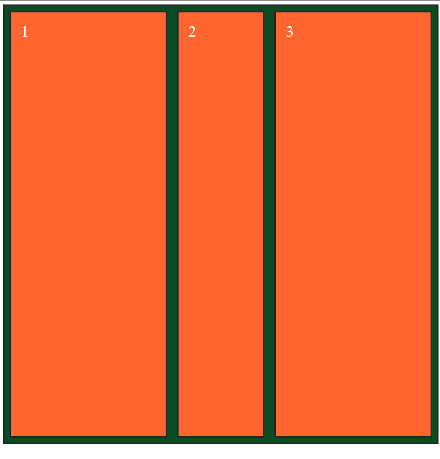

The `flex-grow` value determines the ratio at which the element grows, compared to the other elements with a `flex-grow` property. If the elements get to their `min-width` value, then they'll stop changing their sizes.

``` css
.item-2 {
  min-height: 100px;
  flex-grow: 10;
}
```


`flex-shrink` acts in the opposite direction. The element with the highest `flex-shrink` value will shrink at that much faster ratio when the space in the viewport is scarce.

## Flex basis

In Flexbox, we can replace the use of the `width` property for the `flex-basis` property.

``` css
.flexbox-item {
  background-color: #ff652f;
  border: 3px solid #272727;
  color: #fff;
  font-size: 2em;
  padding: 20px;
  margin: 10px;
  flex-basis: 15%;
}
```

## Flex

We can combine the grow, shrink and basis properties in just one property called `flex`. This property takes three values: grow, shrink, and basis. In the example below, the first and second elements grow and shrink at a ratio of 1, while the third does it at a ratio of 5 (so 5 to 1 grow and shrink). The first element has a basis width of 15%, while the second and third elements have a basis width of 25%.

``` css
.item-1 {
  min-height: 50px;
  flex-grow: 1;
  flex: 1 1 15%;
}

.item-2 {
  min-height: 100px;
  flex: 1 1 25%;
}

.item-3 {
  min-height: 250px;
  flex: 5 5 25%;
}
```

## Align self

We can use the `align-self` property to modify the alignment of different elements individually.

``` css
.item-1 {
  min-height: 50px;
  flex-grow: 1;
  flex: 1 1 15%;
  align-self: center;
}

.item-2 {
  min-height: 100px;
  flex: 1 1 25%;
  align-self: flex-end;
}

.item-3 {
  min-height: 250px;
  flex: 5 5 25%;
  align-self: flex-start;
}
```

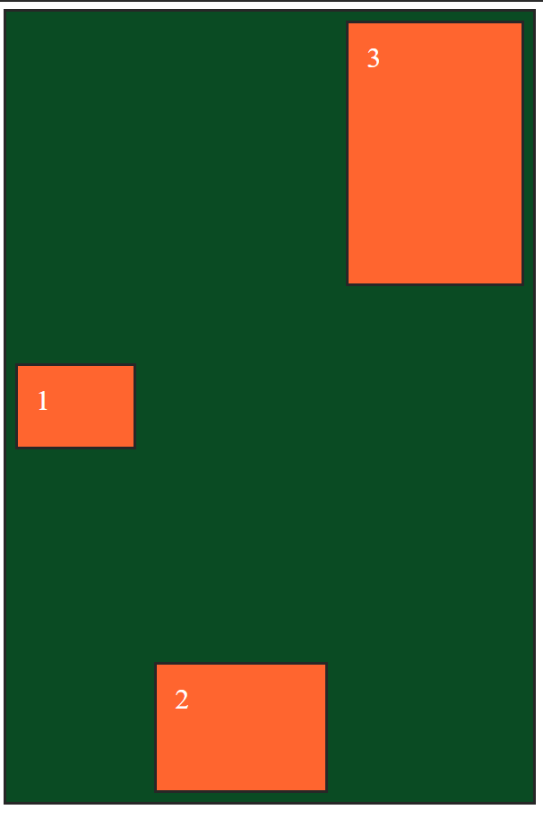

## Centering

Centering (both vertically and horizontally) an element in its parent can be hard in regular CSS. Since we can nest flex containers, we can align the numbers inside the boxes. First we need to set `display: flex;` to the parent of the element that we wish to center. Since we now wish to position the numbers, their parents are the boxes. Therefore, we target the `.flexbox-item` selector. Now each of the boxes is a flex container themselves and we can use the `justify-content` and `align-items` properties to center their children (aka the numbers).

``` css
.flexbox-item {
  background-color: #ff652f;
  border: 3px solid #272727;
  color: #fff;
  font-size: 2em;
  padding: 20px;
  margin: 10px;
  display: flex;
  justify-content: center;
  align-items: center;
}
```

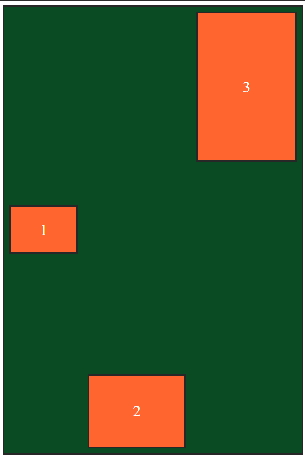

## Ordering

We can change the ordering of the boxes, without changing the HTML. In the HTML we might want to set the elements in certain order for SEO or accessibility. We can then change it with CSS Flexbox, using the `order` property. This property takes a number, which represents the order in which chile elements should be displayed inside the parent element.

``` css
.item-1 {
  min-height: 50px;
  flex-grow: 1;
  order: 2;
}

.item-2 {
  min-height: 100px;
  order: 1;
}

.item-3 {
  min-height: 250px;
  order: 3;
}
```

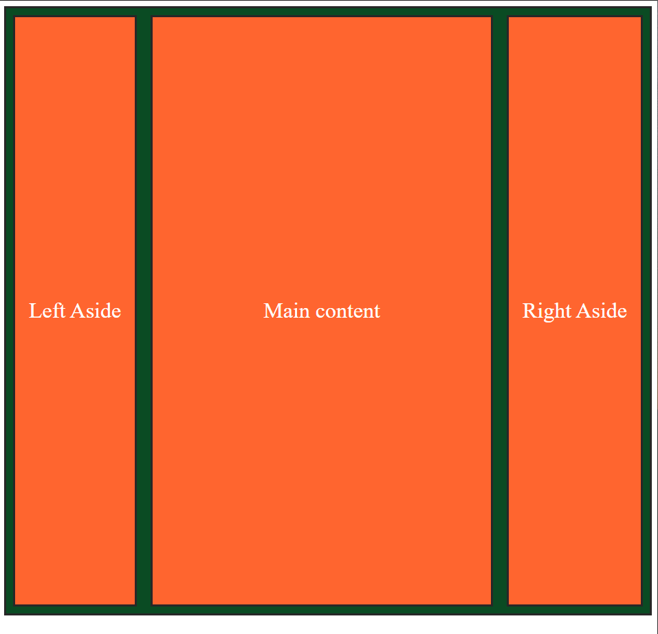
