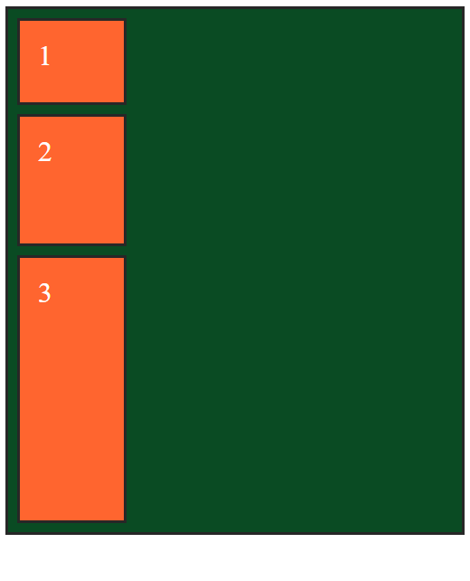
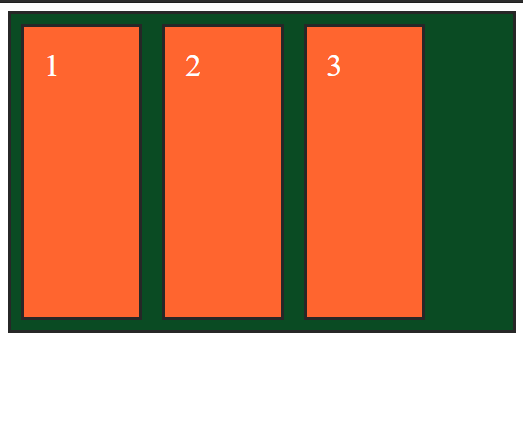
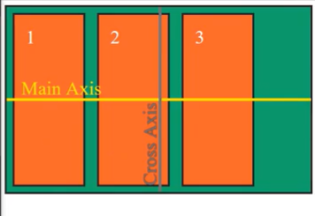
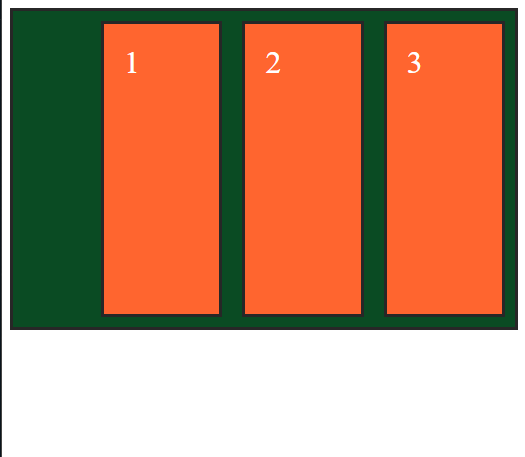
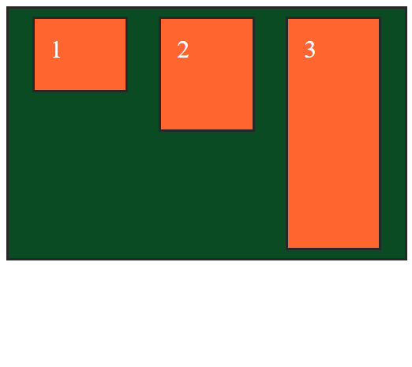

# CSS Flexbox

Notes from codeSTACKr's CSS Flexbox tutorial. You can watch the tutorial [here](https://www.youtube.com/watch?v=qqDH0T6K5gY).

## What is Flexbox?

Flexbox is a layout mode in CSS3. It provides a more efficient way to lay out, align, and distribute space among items in a container. It's called Flexbox because it can handle unknown or dynamic sizes too. Before Flexbox, there were 4 layout modes:

- **Block layout** for laying out documents.  
- **Inline layout** for laying out text.  
- **Positioned layout** for explicit positioning.  
- **Table layout** for laying out 2D tabular data.  

## Example

In our example we have three `div`s of different `min-height`. At the start, since `div`s are block-level elements, they all start in their own lines, so they are stack on top of each other.



With Flexbox we can set the display property to `display: flex;` and now our `div`s will not take up an entire row each. This happens because setting `display: flex;`, we are telling the browser that this is not a regular container, but a *flexbox container*, and the default for a flexbox container is to display elements in a row.

``` css
.flexbox-container {
  display: flex;
}
```



The Flexbox layout is *directionaly agnostic*, as opposed to the block layout which is vertically based, or the inline layout which is horizontally based.

In Flexbox we have two axes. The main axis always follows the direction of the flexbox. By default, flexbox is layout as row and, therefore, the main axis is horizontal.



Also by default, all child elements will be aligned to the left of their parent container. There is a property called `justify-content` which alows us to change how the content of a flexbox is justified. By default, `justify-content: flex-start;` (this means left), but we can change it to, for example, `justify-content: flex-end;` and the elements will align right. There are several options to choose from, but keep in mind that they all distribute elements in reference to the main axis.

``` css
.flexbox-container {
  display: flex;
  background: #0a4b23;
  border: 3px solid #272727;
  justify-content: flex-end;
}
```



To modify how items are aligned about the cross-axis, we use the `align-items` property. By default this property is set to `stretch`. This is why, even thou we set `min-height` property in all of them, they all stretch out as much as their parent container allows them to do. If we change to `align-items: flex-start;` the child elements will start from the top and stop stretching when they reach their respective `min-height`.

``` css
.flexbox-container {
  display: flex;
  background: #0a4b23;
  border: 3px solid #272727;
  justify-content: space-evenly;
  align-items: flex-start;
}
```



