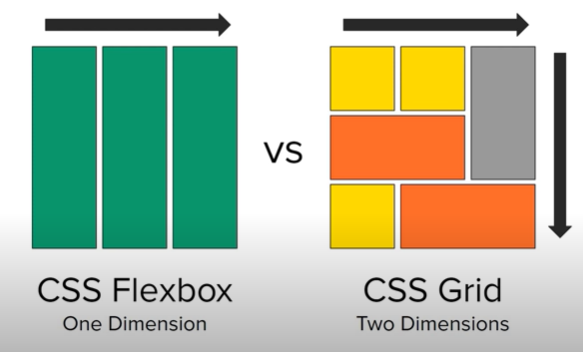
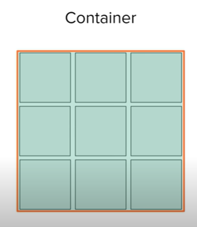
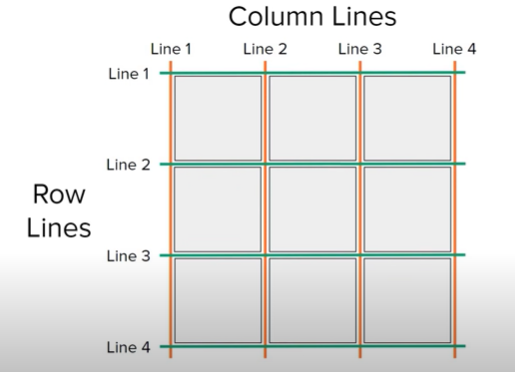
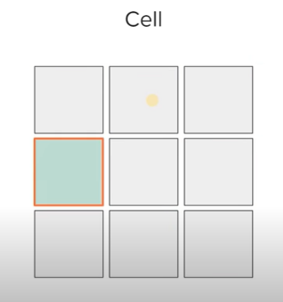
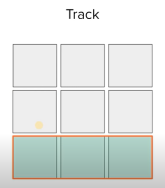
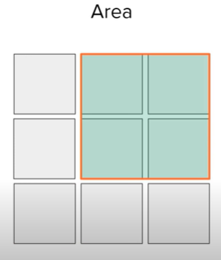

# CSS Grid

Notes from codeSTACKr's CSS Grid tutorial. You can watch the tutorial [here](https://www.youtube.com/watch?v=0-DY8J_skZ0).

## What is CSS Grid?

CSS Grid is a positioning and layout framework. Unlike Flexbox which is one dimensional, Grid is a two dimensional positioning system, so it can handle both rows and columns at the same time.

When using Grid, we need to have a container wrapping our grid items.

In Grid, rows and columns are diffined by the lines. We use these lines to tell Grid how to span the different items.

Each block in our grid is called a *Cell*.

An entire row or column in Grid is called a *Track*.

In Grid we can define *Areas*, which are rectangular or squared groups of Grid cells.

