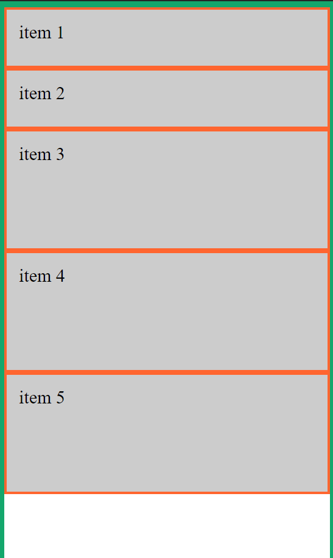
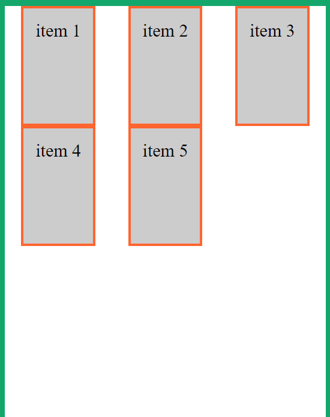
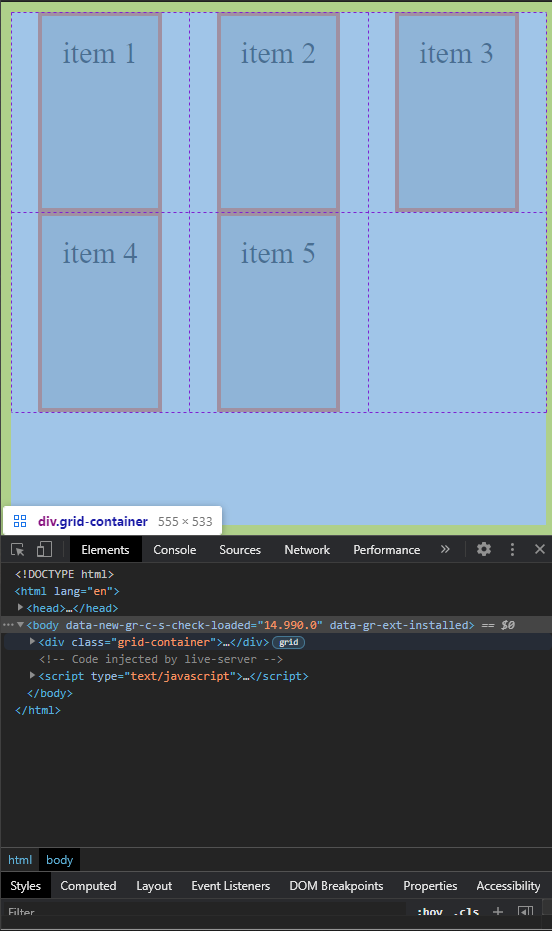
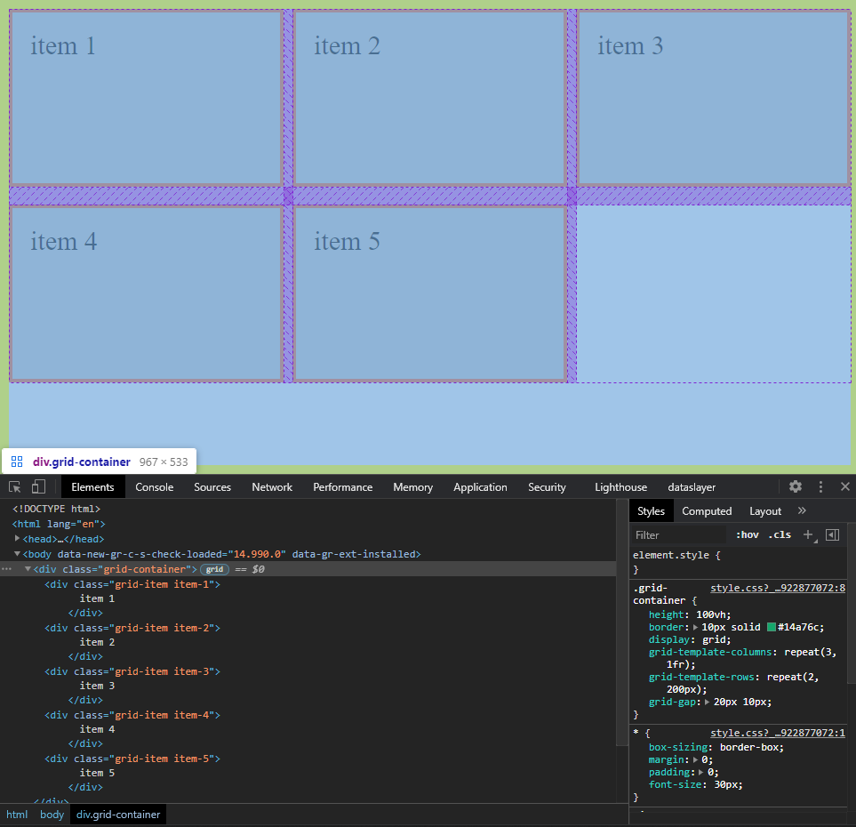

# CSS Grid

Notes from codeSTACKr's CSS Grid tutorial. You can watch the tutorial [here](https://www.youtube.com/watch?v=0-DY8J_skZ0).

### Table of content
[What is CSS Grid?](#what-is-css-grid)
[Creating a Grid](#creating-a-grid)
[Positioning items](#positioning-items)
[Grid gap](#grid-gap)

## What is CSS Grid?

CSS Grid is a positioning and layout framework. Unlike Flexbox which is one dimensional, Grid is a two dimensional positioning system, so it can handle both rows and columns at the same time.


When using Grid, we need to have a container wrapping our grid items.


In Grid, rows and columns are diffined by the lines. We use these lines to tell Grid how to span the different items.


Each block in our grid is called a *Cell*.


An entire row or column in Grid is called a *Track*.


In Grid we can define *Areas*, which are rectangular or squared groups of Grid cells.


## Creating a Grid

To create a grid, the first thing we need to do is to display our container as a grid.

``` css
.grid-container {
  height: 100vh;
  border: 10px solid #14a76c;
  display: grid;
}
```

Next, we need to define our columns. To do that, we use the `grid-template-columns` property. This property takes as many values as columns we want to define. Each column is defined as a unit of measurement, and we can combine different units of measurement. We can use the `repeat()` function to build the template. This function takes two values, the number or repetitions, and the unit of measurement.

``` css
.grid-container {
  height: 100vh;
  border: 10px solid #14a76c;
  display: grid;
  grid-template-columns: repeat(3, 1fr);
}
```

We define rows the same way we did with columns.

``` css
.grid-container {
  height: 100vh;
  border: 10px solid #14a76c;
  display: grid;
  grid-template-columns: repeat(3, 1fr);
  grid-template-rows: repeat(2, 200px);
}
```

If we omit any definition, the rows or columns will stretch to fill, distributing space evenly amongst them. To override this default behavior we can use the `grid-auto-rows` or `grid-auto-columns` properties. These properties take a unit of measurement as their value and it determines how the `auto` rows or columns will look like.

``` css
.grid-container {
  height: 100vh;
  border: 10px solid #14a76c;
  display: grid;
  grid-template-columns: repeat(1, 1fr);
  grid-template-rows: repeat(2, 100px);
  grid-auto-rows: 200px;
}
```



## Positioning items

To horizontally positioning items we use the `justify-items` property. By default, this property is set to `stretch`, which is why by default items take up as much space as they can. We can change this value to different values like `start`, `end`, `center`, etc.

``` css
.grid-container {
  height: 100vh;
  border: 10px solid #14a76c;
  display: grid;
  grid-template-columns: repeat(3, 1fr);
  grid-template-rows: repeat(2, 200px);
  justify-items: center;
}
```



Here we chose `center`, that centers each item withing its cell. We can see this the dev tools. When we hover over the `.grid-container`, Chrome shows us the grid lines.



Likewise, to vertically position the elements we use the `align-items` property. This property also takes a positional values like `end`, `start`, `center`, etc.

``` css
.grid-container {
  height: 100vh;
  border: 10px solid #14a76c;
  display: grid;
  grid-template-columns: repeat(3, 1fr);
  grid-template-rows: repeat(2, 200px);
  justify-items: center;
  align-items: center;
}
```


We can also align the entire gird within the container. To achive this we use the `justify-content` and `align-content` properties for horizontal and vertical alignment respectively.

``` css
.grid-container {
  height: 100vh;
  border: 10px solid #14a76c;
  display: grid;
  grid-template-columns: repeat(3, 150px);
  grid-template-rows: repeat(2, 200px);
  justify-content: center;
  align-content: center;
}
```


## Grid gap

We can add a gap (space) between our elements using the `grid-row-gap` and `grid-column-gap` properties. These take a unit of measurement as their value, which represents the amount of gap to be left between elements. If we want to specify gap for both rows and columns we can use the `grid-gap` property. This property takes units of measurement as its value. It can take 1 or 2 values. If 1 value is specified then that will be the amount of space left between elements in both row and column-wise. If two values are specifies, the first one will be used for row gap, and the second one for column gap.

``` css
.grid-container {
  height: 100vh;
  border: 10px solid #14a76c;
  display: grid;
  grid-template-columns: repeat(3, 1fr);
  grid-template-rows: repeat(2, 200px);
  grid-gap: 20px 10px;
}
```



