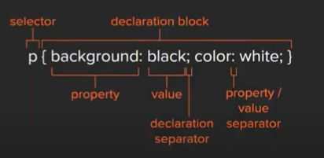
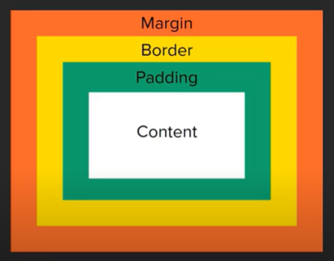

# codeSTACKr's CSS tutorial


Notes from codeSTACKr's HTML tutorial. You can watch the tutorial [here](https://www.youtube.com/watch?v=Tfjd5yzCaxk).


Table of content:

[What is CSS?](#what-is-css)  
[CSS Usage](#css-usage)  
[Anatomy of a CSS rule](#anatomy-of-a-css-rule)  
[Colors](#colors)  
[Fonts](#fonts)  
[Units of measurement](#units-of-measurement)  
[Borders](#borders)  
[Padding](#padding)  
[Margins](#margins)  
[Box Model](#box-model)


## What is CSS?

CSS stands for Cascading Style Sheets and, just like HTML, it's not a programming language. CSS is a styling languague and it's used for website layout and design.

The main idea behind CSS is that we can use a *selector* to target an HTML element, and apply to it the style defined in the `.css`. This style is defined with key-value paris called *attributes* and it changes how the element is displayed on the web page.

## CSS usage

There are three ways of using CSS:

1. **Inline:** we can add a `style` attribute to HTML tags and define the style in there. This is extremedly discouraged!! With inline each element needs to be styled separately.

2. **Internal:** we can add a `<style>` element in the `<head>` element of our webpage. This is not the recommended practice since it makes files larger and the styles defined can only be used in one HTML file.

3. **External:** we use a separate `.css` file and link the HTML page or pages that we want to use this styles using a `<link>` tag with a `href="style.css"` in the HTML `<head>`. This makes the CSS file reusable across multiple pages, makes the HTML code file lighter and easier to mantain, and achieves *separation of concerns*.

## Anatomy of a CSS rule

First we name the selector. Next comes the declaration block. This block is delimited by `{}`. Inside of it we'll place property-value pairs separated by a colon `:`. Each property-value pair ends with a semi-colon `;` and should take up it's own line. 



Selectors come in many forms. We can select all instances of an HTML tag, all instances of a class, ids, or combinations of them. You can find the complete list of selectors [here](https://www.w3schools.com/cssref/css_selectors.asp).

## Colors

The are several different ways in which we can define color values for all color-related properties.

- HTML color names: some colors have names like `black`, `white`, `blue`, etc. There's over 140 defined HTML colors. You can find a complete list of HTML color names [here](https://www.codestackr.com/blog/html-color-names/).

- HEX values: this are 3 or 6 digit long alphanumerical combinations that represent hexadecimal numbers prefixed by a `#` sign. In general we need to use the complete 6 digits of a HEX value, but if all 6 digits are the same, CSS will let us use 3 instead. So, `#ffffff` becomes `#fff`.

- rgb/rgba: *rgb* stands for `red, green and blue`. Here we specify the amound of each color that our color should take in a 0 to 255 scale. So, for example, `red = rgb(255, 0, 0)`, or `white = rgb(255, 255, 255)`. *rgba* is similar but adds the *alpha* value or transparency value for our color. Alpha ranges from 0 to 1 where 0 is complete transparency and 1 if total opacity.

## Fonts

There are several different fonts that can be used. Two of the most common are `Serif` (fancier and with more details) and `Sans Serif` (modern and plain). When choosing a font we need to make sure that it's `Web Safe Fonts` since not all fonts will work in all browsers. If we choose a font that is not WSF, make sure to include the necessary code in the HTML `<head>` to import it. 

When choose a font in CSS we use the `font-family` property and pass a list of different fonts. The browser will try using the first one and, if it can't, it will fault back to the next one on the list and so on.

``` css
selector {
  font-family: Arial, Helvetica, sans-serif;
}
```

We usually declare the `font-family` property in the `body` selector to affect everything in our web page with just one rule.

To change the size of the text we use the `font-size` property. By default this is `16px`.

## Units of measurement

Units can be grouped into two categories: absolute units and relative units. Absolute units, such as `px` (pixels), are tied to physical units of length. They approximate the actual measurement on a screen.

Relative units, such as `em`, are relative to another length value. For example, `em` is based on the size of an elements font. So if the font size is 16px, a `line-height` of 1em would be equal to 16px, while a `line-heigth` of 0.5em would be equal to 8px.

## Borders

All properties that start with `border-*` control a specific side of the border of the element (such as `div`s and `p`s). So, for example, `border-top` controls the top border, `border-left` the left border, and so on. They take three three values (in any order):

- the border width (a size)  
- the border line type  
- the border color  

If all four sides need to be the same, we can use the `border` property. Keep in mind that CSS is read top to bottom by browser. So if we need three borders to be the same and one to change (say, the bottom), we could use `border` first and `border-bottom` afterwards.

``` css
p {
  border: 5px solid orange;
  border-bottom: 3px dotted blue;
}
```

## Padding

The space between the content of an HTML element and it's border is called the padding. We can use the padding property in our CSS to control it. This property takes a unit as it's value. Just as borders, it can be defined one side at a time using properties like `padding-top`, `padding-left`, and so on, or it can be defined by using the `padding` property and passing 1, 2, or 4 different values.

If we use the `padding` approach we need to rememeber how the values get passed. When using 1 value, all paddings will be the same. When using 2 values, the first one will style top and bottom padding, while the second one will style left and right padding. When using 4 values, the values will be passed starting from top and moving clockwise: top, left, bottom, right.

## Margins

The `margin` property controls the space around an HTML element, preventing other elements from getting closer than the margin value that we specify. It can be defined the same way as `padding` by using separate declarations `margin-top`, `margin-left`, and so on, or by using the `margin` property and passing 1, 2 or 4 values.

## Box Model

All HTML elements can be considered as boxes. The *Box Model* is the name we use when talking about the design and layout of the elements.



 ## Position

Elements can take different positions. Some of them are:

- static: the default. It means the element will take it's position where it is in the HTML mark-up.

- relative: this means that it is placed relative to its static position.

- absolute: this means that the element will be positioned relative to its nearest positioned ancestor.

- fixed: this means that the element will be positioned relative to the view port.

- sticky: this is not supported in all browsers and needs a `-webkit-sticky` for Safari. A stiky element will always be visible at the top (or the side specified) if its original position is no longer visible.
